

  
  
  
  

# 📖 HƯỚNG DẪN SỬ DỤNG HỆ THỐNG ET OFFICE PORTAL (VIP PRO 10/10)

Chào mừng bạn đến với tài liệu hướng dẫn vận hành và sử dụng hệ thống **ET Office Portal**. Tài liệu này hướng dẫn chi tiết từng bước cho cả **Nhân viên**, **Trưởng phòng (Leader)**, **Quản lý dự án (PM)** và **Ban Quản trị (Admin)** với hình ảnh chụp thực tế giao diện ứng dụng.

---

## 📑 MỤC LỤC CHI TIẾT

1. [Cài đặt & Truy cập Ứng dụng PWA trên Điện thoại](#1-cài-đặt--truy-cập-ứng-dụng-pwa-trên-điện-thoại)
2. [Đăng Nhập, Đổi Mật Khẩu & Quên Mật Khẩu](#2-đăng-nhập-đổi-mật-khẩu--quên-mật-khẩu)
3. [Dashboard Quản Trị & Tổng Quan Sĩ Số](#3-dashboard-quản-trị--tổng-quan-sĩ-số)
4. [Chấm Công Hàng Ngày (GPS, Selfie & Chống Gian Lận Thiết Bị)](#4-chấm-công-hàng-ngày-gps-selfie--chống-gian-lận-thiết-bị)
5. [Quản Lý Đơn Từ & Quy Trình Duyệt Đa Cấp](#5-quản-lý-đơn-từ--quy-trình-duyệt-đa-cấp)
6. [Lịch Tuần Thực Tập Sinh (TTS Schedule) & Trực Nhật](#6-lịch-tuần-thực-tập-sinh-tts-schedule--trực-nhật)
7. [Quản Lý Dự Án & Công Trình (Phân Quyền PM)](#7-quản-lý-dự-án--công-trình-phân-quyền-pm)
8. [Bảng Quản Lý Chi Tiêu & Hoàn Ứng Nội Bộ](#8-bảng-quản-lý-chi-tiêu--hoàn-ứng-nội-bộ)
9. [Bảng Chấm Công Matrix 31 Ngày & Xuất Báo Cáo (PDF/Excel)](#9-bảng-chấm-công-matrix-31-ngày--xuất-báo-cáo-pdfexcel)
10. [Xem Lịch Sử Chấm Công & Bảng Xếp Hạng Chuyên Cần](#10-xem-lịch-sử-chấm-công--bảng-xếp-hạng-chuyên-cần)
11. [Quản Lý Phương Tiện & Vé Gửi Xe Tòa Nhà 17T10](#11-quản-lý-phương-tiện--vé-gửi-xe-tòa-nhà-17t10)
12. [Quản Lý Nhân Sự & Gán Máy Chính Chủ (Admin / Leader)](#12-quản-lý-nhân-sự--gán-máy-chính-chủ-admin--leader)
13. [Thông Tin Cá Nhân & Đăng Ký Xe](#13-thông-tin-cá-nhân--đăng-ký-xe)
14. [Xử Lý Lỗi Thường Gặp (Troubleshooting)](#14-xử-lý-lỗi-thường-gặp-troubleshooting)

---

## 1. Cài đặt & Truy cập Ứng dụng PWA trên Điện thoại

Ứng dụng hỗ trợ công nghệ **Progressive Web App (PWA)**, cho phép cài đặt trực tiếp lên màn hình chính của iPhone (iOS) và Android như một App Native mà không cần tải từ App Store hay Google Play.

  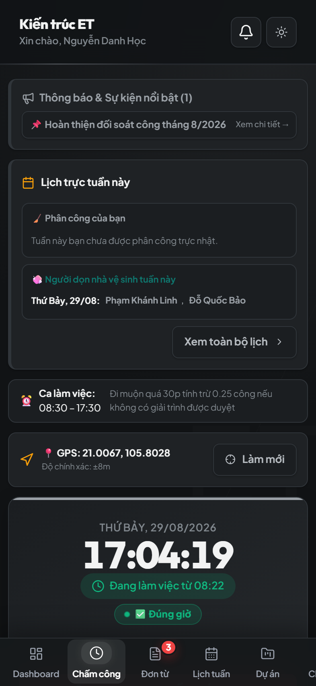

### Cách cài đặt:
- **Trên iOS (Safari)**: Mở link ứng dụng bằng Safari > Bấm biểu tượng **Chia sẻ (Share)** ở thanh công cụ dưới > Chọn **"Thêm vào Màn hình chính" (Add to Home Screen)**.
- **Trên Android (Chrome)**: Mở link ứng dụng > Bấm biểu tượng **Ba chấm** ở góc trên cùng bên phải > Chọn **"Cài đặt ứng dụng"** hoặc **"Thêm vào Màn hình chính"**.

---

## 2. Đăng Nhập, Đổi Mật Khẩu & Quên Mật Khẩu

  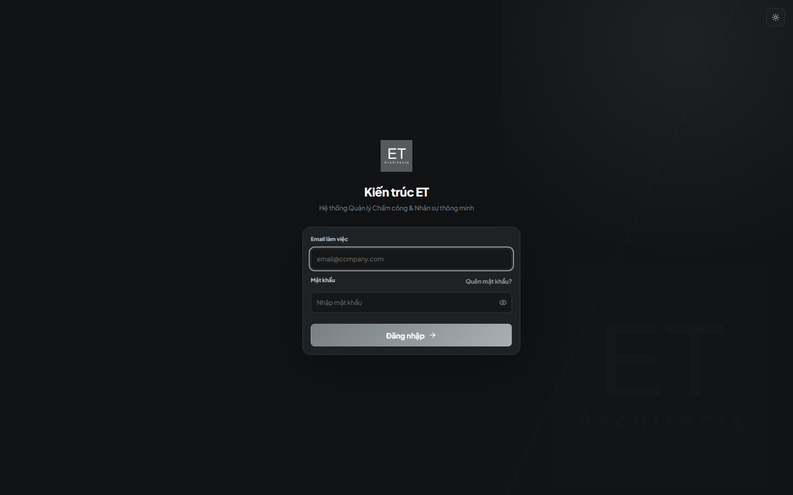

### 2.1. Đăng nhập
- Nhập **Email công ty** (ví dụ: `hoc.nguyen@etoffice.vn`) và **Mật khẩu**.
- Bấm nút **"Đăng nhập hệ thống"**.
- Hệ thống tự động thu thập chữ ký phần cứng phần cứng vật lý (`pure_hardware_uuid`) để xác định thiết bị chính chủ.

### 2.2. Quên mật khẩu & Khôi phục bằng mã OTP
1. Tại màn hình Đăng nhập, bấm liên kết **"Quên mật khẩu?"**.
2. Nhập Email tài khoản cần khôi phục và bấm **"Gửi mã xác nhận"**.
3. Kiểm tra hộp thư Email nhận mã xác thực OTP 6 số.
4. Nhập mã OTP cùng Mật khẩu mới và bấm **"Đặt lại mật khẩu"** để hoàn tất.

---

## 3. Dashboard Quản Trị & Tổng Quan Sĩ Số

  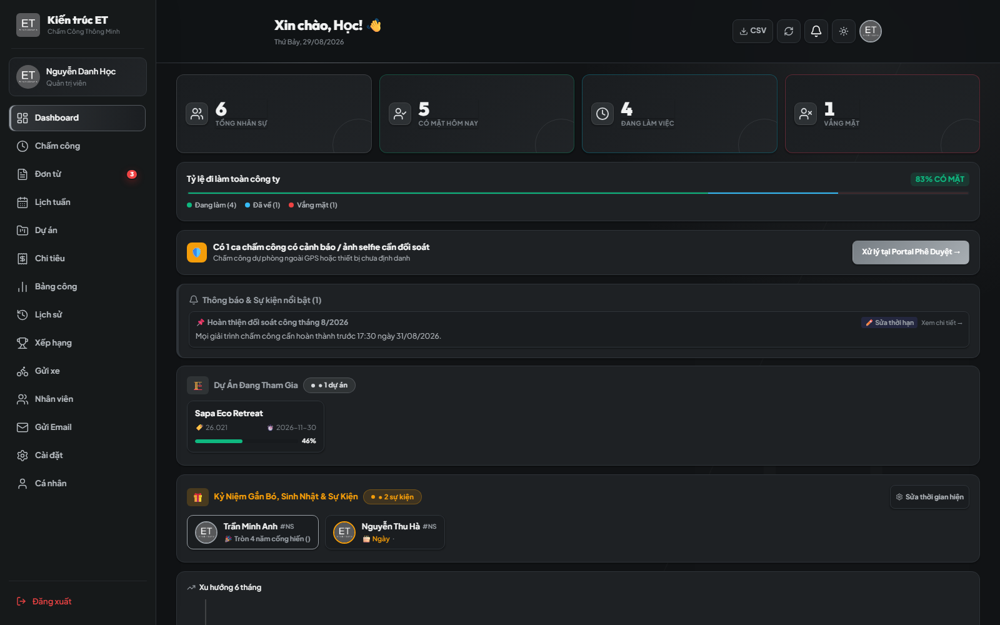

Dành cho vai trò **Admin** và **Trưởng phòng (Leader)**:
- **Thống kê sĩ số Realtime**: Tổng nhân sự, Có mặt, Đi muộn, Nghỉ phép, Đang làm việc từ xa (WFH).
- **Cảnh báo cần xử lý**: Đơn từ mới nộp, ca chấm công nghi vấn / thiết bị lạ cần phê duyệt.
- **Biểu đồ chuyên cần tuần/tháng**: Theo dõi tỷ lệ đúng giờ và biến động nhân sự trực quan.

---

## 4. Chấm Công Hàng Ngày (GPS, Selfie & Chống Gian Lận Thiết Bị)

  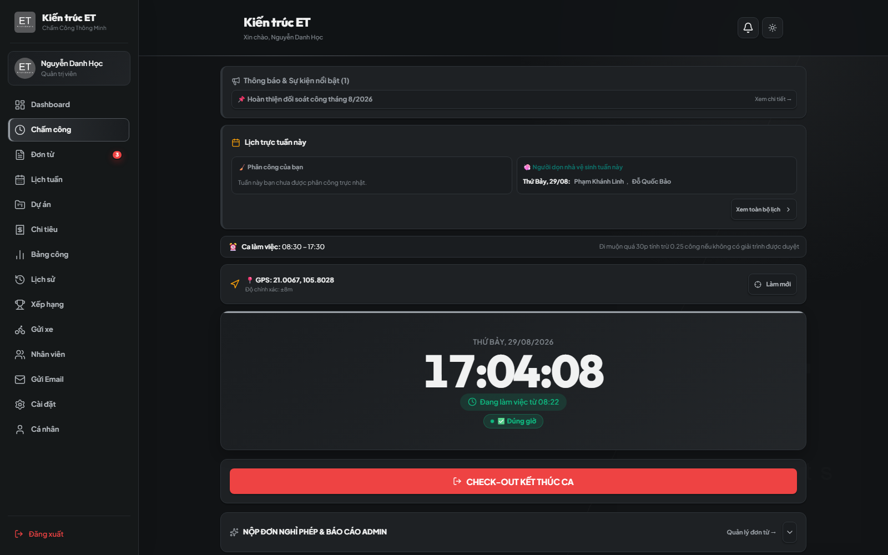

### 4.1. Quy trình Check-in (Vào ca)
1. Truy cập mục **"Chấm công"**.
2. Chọn hình thức làm việc tương ứng:
   - 🏢 **Tại văn phòng**: GPS sẽ kiểm tra bán kính Geofencing quanh trụ sở công ty.
   - 🏗️ **Tại công trình**: Chọn dự án đang phụ trách.
   - 🤝 **Gặp khách hàng**: Nhập tên khách hàng và địa điểm làm việc.
   - 🏠 **Làm việc từ xa (WFH)**: Yêu cầu đã có đơn WFH được phê duyệt.
3. Bấm **"Lấy toạ độ GPS"** và cho phép trình duyệt truy cập vị trí.
4. Nếu thiết bị chưa được đánh dấu là Máy chính chủ, camera sẽ bật để chụp **Ảnh Selfie xác thực**.
5. Bấm nút **"Xác nhận Chấm công vào ca"**.

### 4.2. Quy trình Check-out (Ra ca)
- Thực hiện tương tự vào cuối ngày để ghi nhận giờ kết thúc ca làm và tính toán giờ tăng ca OT (nếu sau 18:30).

---

## 5. Quản Lý Đơn Từ & Quy Trình Duyệt Đa Cấp

  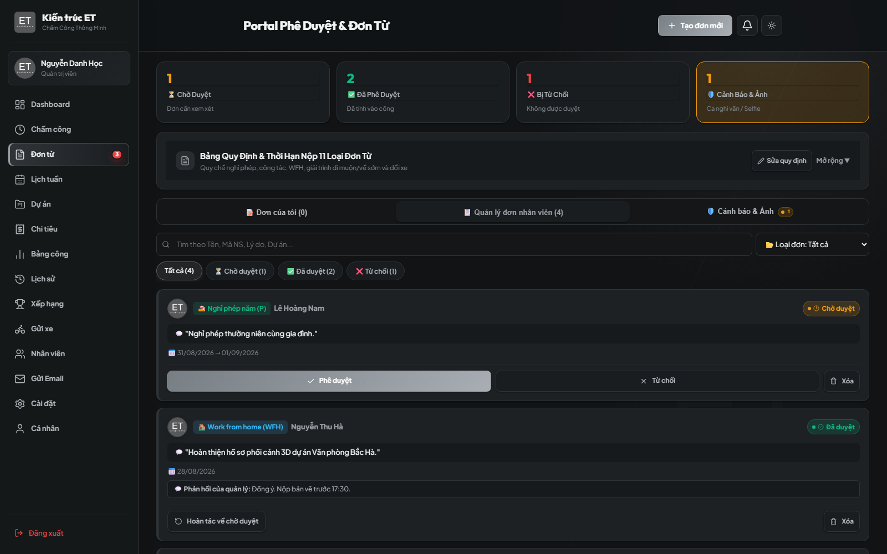

### 5.1. Nộp đơn từ mới
1. Vào mục **"Đơn từ"** > Bấm **"Tạo đơn mới"**.
2. Chọn loại đơn: *Nghỉ phép năm (P), Nghỉ ốm (O), Nghỉ không lương (KL), Làm thêm giờ (OT), WFH, Công tác, Giải trình công, Đổi xe...*
3. Chọn khoảng thời gian (Ngày bắt đầu, Ngày kết thúc) và nhập lý do chi tiết.
4. Bấm **"Gửi đơn duyệt"**.

### 5.2. Phê duyệt, Từ chối & Hoàn tác (Admin / Leader)
- **Duyệt đơn**: Bấm nút **"Duyệt"** màu xanh. Số ngày phép sẽ tự động được trừ trong quỹ phép năm.
- **Từ chối đơn**: Bấm **"Từ chối"** kèm nhập lý do phản hồi cho nhân viên.
- **Hoàn tác (`Revert`)**: Nếu duyệt nhầm, Admin/Leader có thể bấm **"Hoàn tác"** để đưa đơn về trạng thái chờ duyệt. Quỹ phép sẽ tự động hoàn lại đầy đủ.

---

## 6. Lịch Tuần Thực Tập Sinh (TTS Schedule) & Trực Nhật

  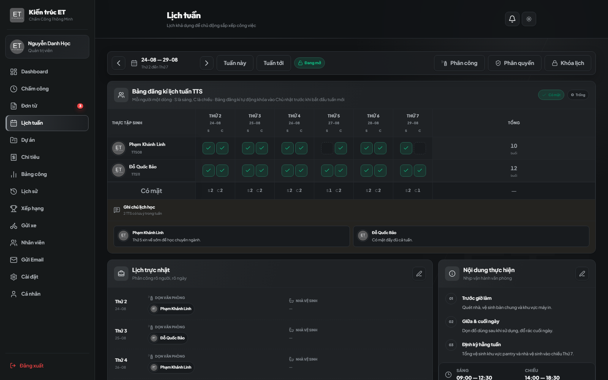

- Hiển thị lịch đăng ký ca làm việc linh hoạt theo từng buổi (Sáng / Chiều / Cả ngày) từ Thứ 2 đến Thứ 7.
- Tích hợp lịch phân công trực nhật văn phòng tự động, giúp quản lý lịch trình làm việc nhóm rõ ràng.

---

## 7. Quản Lý Dự Án & Công Trình (Phân Quyền PM)

  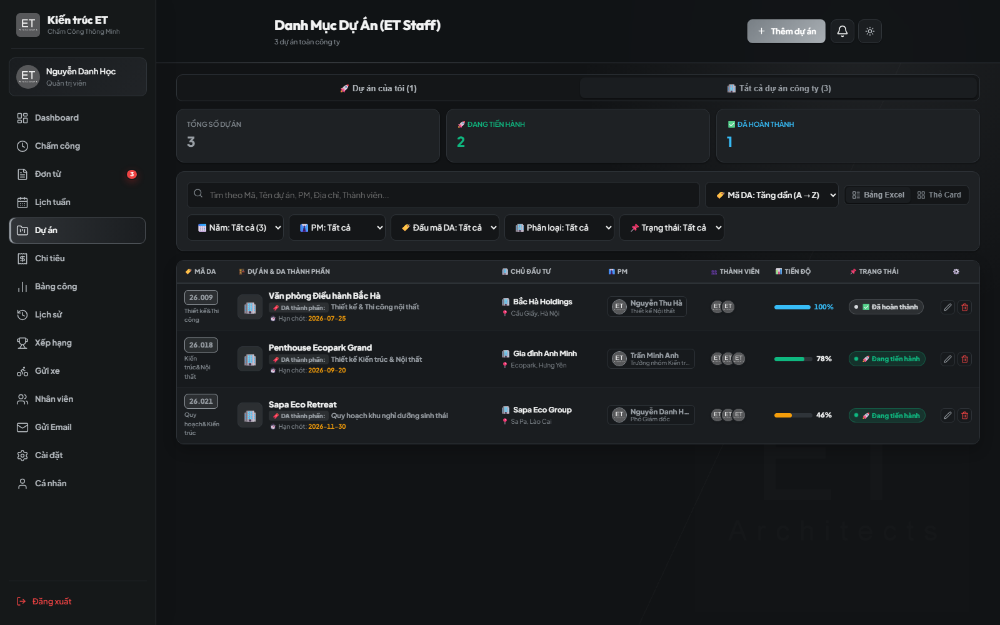

### Quyền hạn:
- **Admin**: Tạo mới, chỉnh sửa mọi thông tin, giao quyền PM cho nhân sự và xóa dự án.
- **Project Manager (PM)**: Được quyền chỉnh sửa tiến độ (%), thời hạn deadline và cập nhật ghi chú của dự án mình phụ trách.

---

## 8. Bảng Quản Lý Chi Tiêu & Hoàn Ứng Nội Bộ

  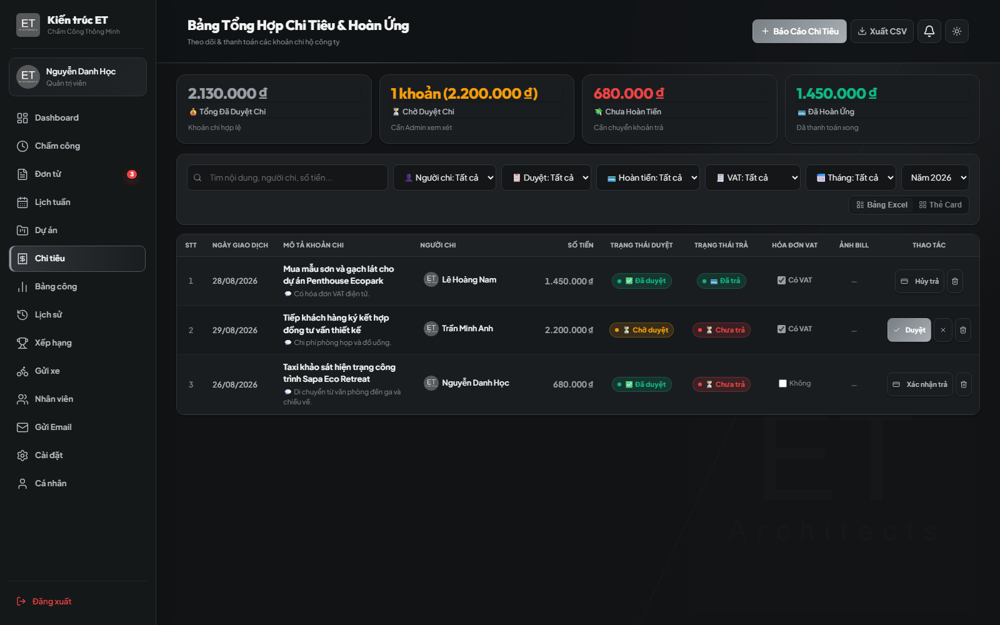

- Quản lý các khoản tạm ứng, chi mua sắm thiết bị, chi phí công tác và hoàn ứng.
- Đính kèm chứng từ/hóa đơn minh bạch, phê duyệt chi tài chính theo luồng chuẩn.

---

## 9. Bảng Chấm Công Matrix 31 Ngày & Xuất Báo Cáo (PDF/Excel)

  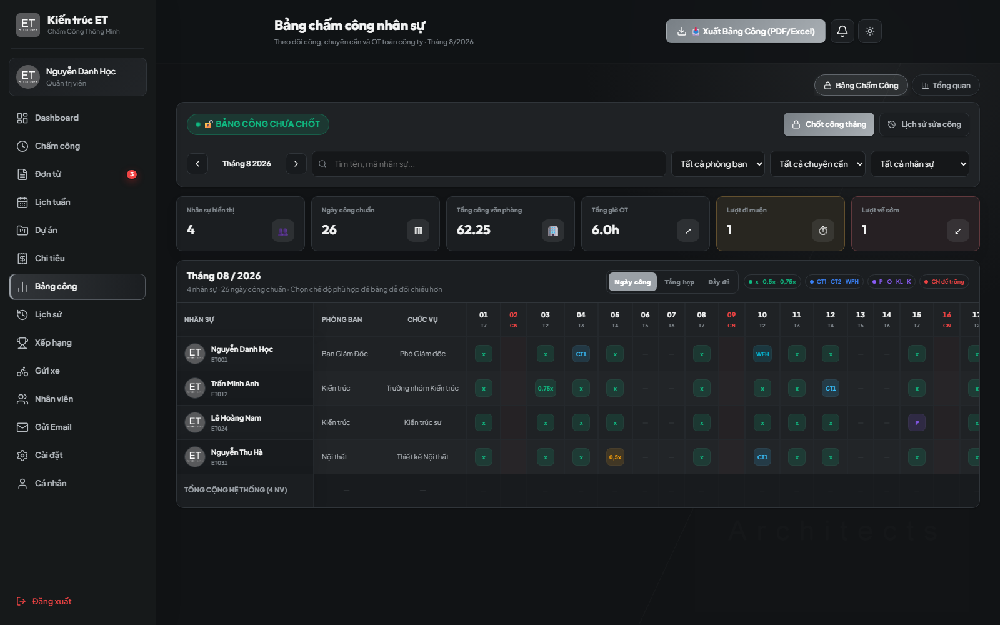

### Tính năng báo cáo chuyên sâu:
- Ma trận 31 ngày hiển thị ký hiệu chuẩn: `X` (Đi làm đủ), `L1-L4` (Đi muộn các mức), `P` (Nghỉ phép), `O` (Nghỉ ốm), `OT` (Tăng ca).
- **Chốt công tháng**: Khóa dữ liệu bảng công sau khi đối soát xong để phục vụ tính lương.
- **Xuất báo cáo**:
  - **Xuất Excel (.xlsx)**: File chuẩn công thức bảng tính.
  - **Xuất PDF A4 Vector**: Định dạng trang in đẹp, sẵn sàng trình ký Ban Giám Đốc.

---

## 10. Xem Lịch Sử Chấm Công & Bảng Xếp Hạng Chuyên Cần

| Lịch Sử Chấm Công Cá Nhân | Bảng Xếp Hạng Chuyên Cần |
|:---:|:---:|
| 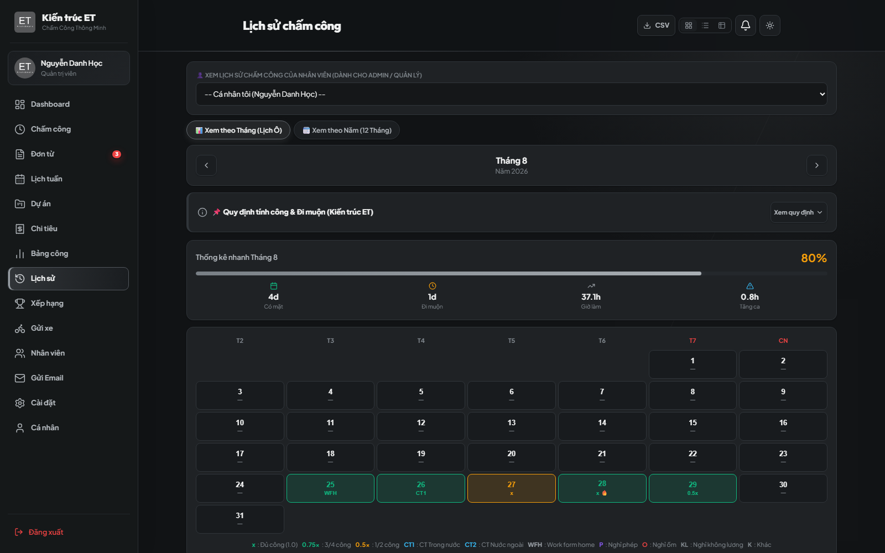 | 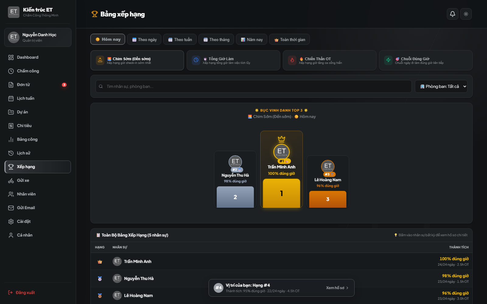 |

- **Lịch sử cá nhân**: Xem chi tiết từng ngày làm việc, giờ vào/ra, số phút đi muộn, giờ OT và vị trí GPS.
- **Bảng xếp hạng**: Tôn vinh top nhân viên đi làm đúng giờ nhất theo Ngày, Tuần, Tháng.

---

## 11. Quản Lý Phương Tiện & Vé Gửi Xe Tòa Nhà 17T10

  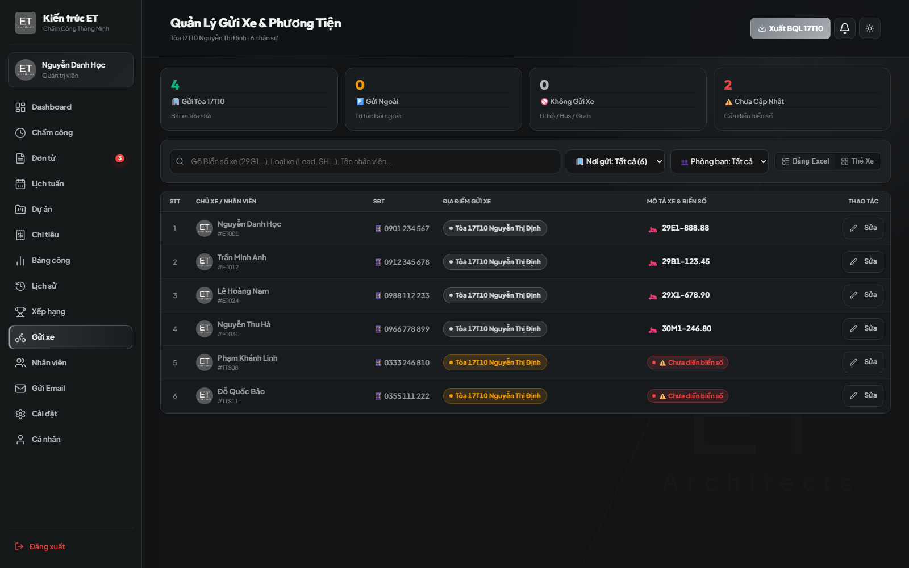

- Quản lý biển số xe, loại xe và điểm gửi xe của toàn bộ nhân viên.
- Nhân viên gửi yêu cầu đổi xe qua form đơn từ; Admin duyệt để cập nhật danh sách vé xe gửi ban quản lý tòa nhà.

---

## 12. Quản Lý Nhân Sự & Gán Máy Chính Chủ (Admin / Leader)

  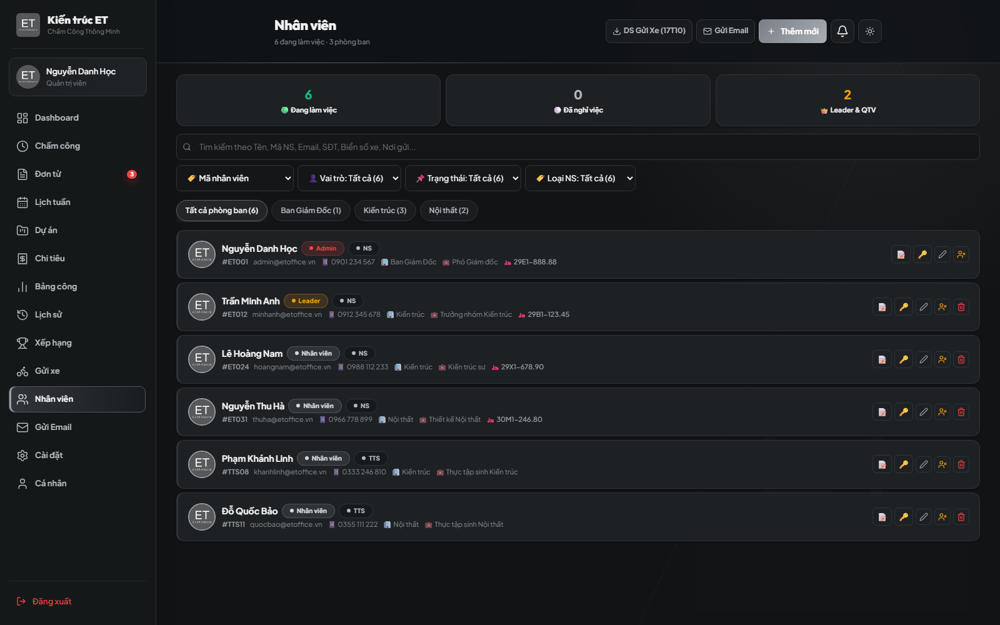

- Quản lý danh sách nhân sự, phân phòng ban, cấp quyền tài khoản.
- **Quản lý thiết bị (`Devices`)**: Xem danh sách máy nhân viên đã dùng để chấm công, bấm nút **`⭐ Đặt máy chính`** để tin cậy thiết bị hoặc xóa thiết bị cũ.

---

## 13. Thông Tin Cá Nhân & Đăng Ký Xe

  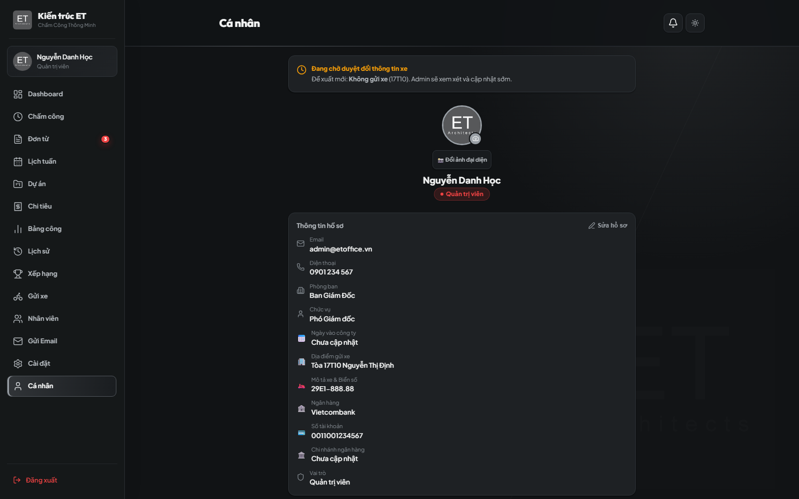

- Xem thông tin hồ sơ, chức vụ, phòng ban và quỹ ngày phép năm còn lại.
- Tự đổi mật khẩu định kỳ và cập nhật biển số phương tiện cá nhân.

---

## 14. Xử Lý Lỗi Thường Gặp (Troubleshooting)

| Vấn đề gặp phải | Nguyên nhân phổ biến | Cách khắc phục nhanh |
|---|---|---|
| Không lấy được vị trí GPS | Chưa cấp quyền Vị trí cho trình duyệt | Bấm biểu tượng 🔒 cạnh URL > Cho phép **Location (Vị trí)** > Tải lại trang. |
| Bị báo "Ngoài bán kính cho phép" | Đang đứng xa văn phòng/công trình | Di chuyển lại gần địa điểm quy định hoặc chọn hình thức "Đi gặp khách hàng" / "WFH". |
| Bị yêu cầu chụp ảnh Selfie | Dùng thiết bị mới hoặc chưa được gán Máy chính | Chụp ảnh rõ mặt để gửi chấm công, sau đó nhờ Leader/Admin duyệt ca và đặt làm **Máy chính chủ**. |
| Đơn từ không được cộng trả phép sau khi hủy | Bấm xóa thủ công thay vì hoàn tác | Sử dụng tính năng **Hoàn tác (`Revert`)** để hệ thống tự động hoàn lại quỹ phép. |

---

*Tài liệu được phát hành và duy trì bởi **Nguyễn Danh Học** ([@hocjsoo](https://github.com/hocjsoo)).*

