<p align="center">📘 ET OFFICE PORTAL</p>
<p align="center"><strong>HỆ THỐNG QUẢN LÝ CHẤM CÔNG, PHÊ DUYỆT ĐƠN TỪ & ĐIỀU HÀNH DOANH NGHIỆP THÔNG MINH</strong></p>
<p align="center">
  
  
  
  
</p>

---

## 🧭 MỤC LỤC TRUY CẬP NHANH

<div align="center">

| 📌 Quy Định & Bắt Đầu | 📱 10 Module Chức Năng | 🛡️ Quản Trị & Kỹ Thuật |
|---|---|---|
| [1. Nguyên Tắc Vàng & Kỷ Luật](#1-nguyên-tắc-vàng--quy-định-kỷ-luật) | [Module 1: Chấm Công GPS + Anti-Fraud](#module-1-chấm-công-hàng-ngày-check-in--check-out) | [5. Quy Trình Leader & Admin](#5-quy-trình-dành-cho-leader--admin) |
| [2. Cài Đặt App PWA 1-Chạm](#2-hướng-dẫn-cài-đặt-app-pwa-trên-điện-thoại--máy-tính) | [Module 2: Đơn Từ & Giải Trình (11 Mẫu)](#module-2-quản-lý-đơn-từ--giải-trình) | [6. Cẩm Nang Xử Lý Sự Cố (FAQ)](#6-cẩm-nang-xử-lý-sự-cố-thường-gặp-faq) |
| [3. Đăng Nhập & Đổi Mật Khẩu](#3-đăng-nhập-đổi-mật-khẩu--cập-nhật-hồ-sơ-đầu-tiên) | [Module 3: Lịch Tuần & Trực Nhật](#module-3-lịch-tuần-tts--phân-công-trực-nhật) | [7. Ma Trận Ký Hiệu Chấm Công](#module-6-bảng-chấm-công-matrix--ký-hiệu-chuẩn) |
| [4. Phân Quyền RBAC 3 Cấp](#-bảng-phân-quyền-người-dùng-rbac) | [Module 4: Dự Án & Tiến Độ PM](#module-4-quản-lý-dự-án--tiến-độ) | [8. Tiêu Chuẩn Bảo Mật Anti-Fraud](#-công-nghệ-bảo-mật--anti-fraud-chống-gian-lận) |
| | [Module 5: Chi Tiêu & Hoàn Ứng](#module-5-chi-tiêu--hoàn-ứng-công-tác) | |
| | [Module 6: Bảng Công Matrix & Export](#module-6-bảng-chấm-công-matrix--ký-hiệu-chuẩn) | |
| | [Module 7: Lịch Sử & Sửa Giờ](#module-7-lịch-sử-chấm-công--điều-chỉnh-giờ) | |
| | [Module 8: Bảng Xếp Hạng Thi Đua](#module-8-bảng-xếp-hạng-chuyên-cần--thi-đua) | |
| | [Module 9: Phương Tiện & Vé Xe](#module-9-quản-lý-phương-tiện--gửi-xe) | |
| | [Module 10: Hồ Sơ, Ngân Hàng & Thiết Bị](#module-10-thông-tin-cá-nhân-ngân-hàng--thiết-bị) | |

</div>

---

## 1. NGUYÊN TẮC VÀNG & QUY ĐỊNH KỶ LUẬT

| STT | Nguyên Tắc | Chi Tiết Quy Định |
|:---:|---|---|
| **01** | **Khung giờ làm việc chuẩn** | • **Sáng:** Vào ca trước `08:30:00` — Hết ca sáng `12:00:00`<br>• **Chiều:** Vào ca `13:30:00` — Kết thúc ca `17:30:00`<br>• **Tăng ca (OT):** Tính từ sau `17:30` (khi có đơn phê duyệt). |
| **02** | **Căn cứ tính lương & thưởng** | Dữ liệu chấm công trên hệ thống là **cơ sở pháp lý duy nhất** để tính ngày công, phụ cấp, chuyên cần và quyết toán lương tháng. |
| **03** | **Quy tắc 03 Ngày Giải trình** | Mọi trường hợp quên chấm công, lỗi GPS hoặc công tác phát sinh bắt buộc phải **nộp Đơn Giải Trình trong vòng 03 ngày làm việc**. Quá thời hạn trên, hệ thống sẽ tự động ghi nhận vắng/không tính công. |
| **04** | **Tính trung thực & Chống gian lận** | Nghiêm cấm mọi hành vi chấm công hộ, fake GPS hoặc dùng chung máy. Hệ thống tự động ghi nhận chữ ký phần cứng (`pure_hardware_uuid`) và yêu cầu chụp ảnh Selfie xác thực khi phát hiện bất thường. |

---

## 2. HƯỚNG DẪN CÀI ĐẶT APP (PWA) TRÊN ĐIỆN THOẠI & MÁY TÍNH

Hệ thống được thiết kế theo chuẩn **Progressive Web App (PWA)**, tối ưu mượt mà như app gốc không cần tải qua App Store/CH Play.

```
               HƯỚNG DẪN CÀI ĐẶT NHANH TRÊN ĐIỆN THOẠI
       ┌────────────────────────┐      ┌────────────────────────┐
       │     📱 iPhone (iOS)     │      │   🤖 Android (Samsung/Oppo)│
       ├────────────────────────┤      ├────────────────────────┤
       │ 1. Mở Safari           │      │ 1. Mở Google Chrome    │
       │ 2. Truy cập link portal│      │ 2. Truy cập link portal│
       │ 3. Bấm icon Chia sẻ ⎋   │      │ 3. Bấm Menu 3 chấm ⋮   │
       │ 4. Chọn "Thêm vào MH   │      │ 4. Chọn "Cài đặt ứng   │
       │    chính" (Add to Home)│      │    dụng" (Install App) │
       └────────────────────────┘      └────────────────────────┘
```

<div align="center">
  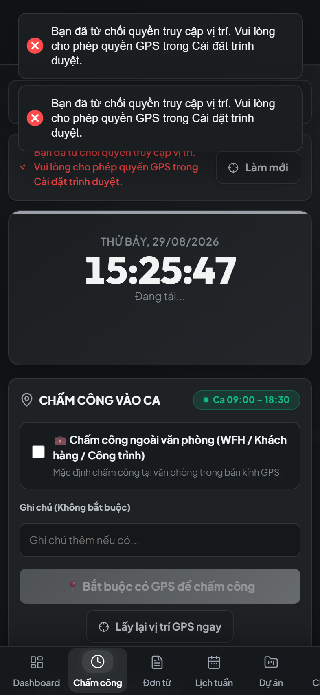
  <p><em>Hình 1: Giao diện ứng dụng PWA chạy toàn màn hình trên điện thoại di động</em></p>
</div>

> 💡 **Khuyến nghị:**
> - Sử dụng **Điện thoại di động** có định vị GPS chính xác để chấm công hàng ngày nhanh nhất (mở app 1 chạm).
> - Sử dụng **Máy tính (PC/Laptop)** để nộp báo cáo chi tiêu, xem bảng công matrix và các tác vụ quản trị.

---

## 3. ĐĂNG NHẬP, ĐỔI MẬT KHẨU & CẬP NHẬT HỒ SƠ ĐẦU TIÊN

<div align="center">
  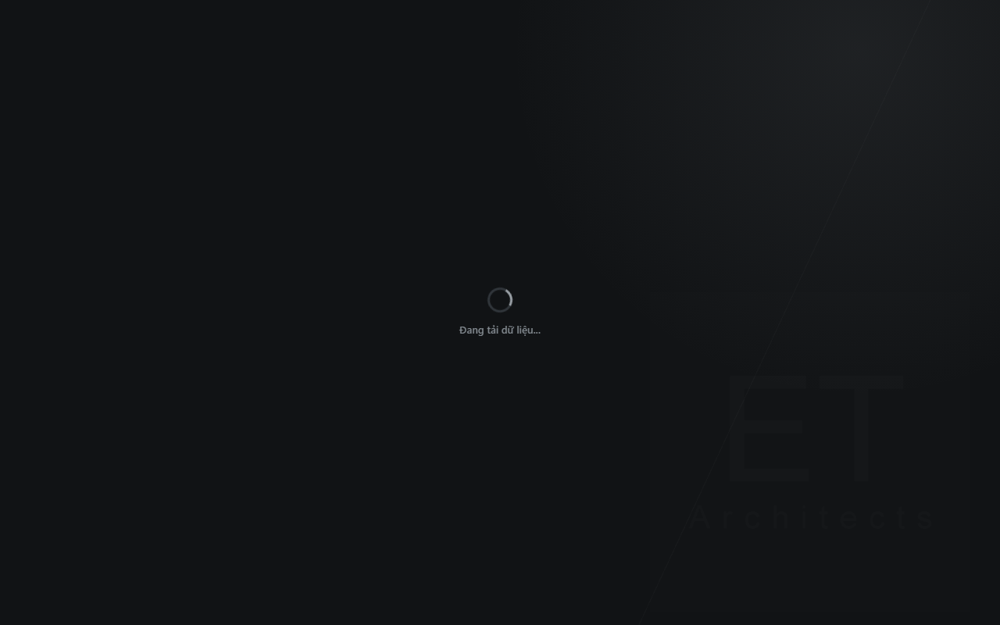
  <p><em>Hình 2: Màn hình Đăng nhập an toàn & Quên mật khẩu OTP</em></p>
</div>

### 3.1. Đăng nhập lần đầu
1. Mở ứng dụng, nhập **Email công ty** và **Mật khẩu khởi tạo** được Admin bàn giao.
2. Bấm **Đăng nhập**.

### 3.2. Đổi mật khẩu bảo mật (Bắt buộc)
1. Vào tab **Cá nhân** (hoặc biểu tượng Avatar góc trên bên phải).
2. Chọn **Đổi mật khẩu**.
3. Nhập mật khẩu hiện tại và mật khẩu mới (tối thiểu 6 ký tự, gồm cả chữ và số) -> Bấm **Cập nhật**.

### 3.3. Quên mật khẩu
- Tại màn hình đăng nhập, bấm **Quên mật khẩu?** -> Nhập Email -> Hệ thống gửi mã OTP 6 số bảo mật qua Email trong 5 giây -> Nhập OTP và đặt lại mật khẩu mới.

---

## 4. CHI TIẾT 10 MODULE CHỨC NĂNG CHÍNH

```
                   SƠ ĐỒ 10 MODULE TRÊN THANH ĐIỀU HƯỚNG
┌────────────┬────────────┬────────────┬────────────┬────────────┐
│ 1.Check-in │ 2. Đơn từ  │ 3.Lịch tuần│ 4. Dự án   │ 5.Chi tiêu │
├────────────┼────────────┼────────────┼────────────┼────────────┤
│ 6.Bảng công│ 7. Lịch sử │ 8.Xếp hạng │ 9. Gửi xe  │10.Cá nhân  │
└────────────┴────────────┴────────────┴────────────┴────────────┘
```

---

### MODULE 1: CHẤM CÔNG HÀNG NGÀY (CHECK-IN / CHECK-OUT)

<div align="center">
  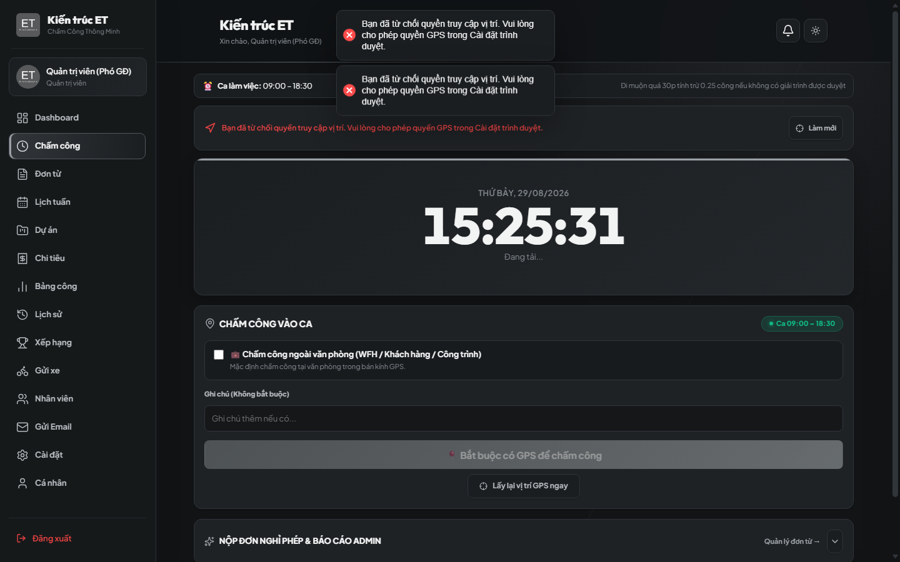
  <p><em>Hình 3: Giao diện Chấm công GPS — Tích hợp Thông báo và Lịch trực nhật tuần ở đầu trang</em></p>
</div>

- **Vị trí:** Trang chủ khi mở ứng dụng.
- **Quy trình chuẩn:**
  1. Mở app, đứng trong phạm vi văn phòng / công trường (bán kính cho phép ~100m).
  2. Xem **Thông báo quan trọng** và **Lịch trực nhật tuần** hiển thị nổi bật ở đầu trang.
  3. Bấm nút tròn to: **🟢 CHECK-IN** (Đầu ca) hoặc **🔴 CHECK-OUT** (Cuối ca).
  4. Màn hình báo xanh và hiển thị khoảng cách GPS thực tế: *"Chấm công thành công"*.

```
                   CƠ CHẾ BẢO VỆ & XÁC THỰC THIẾT BỊ
        ┌──────────────────────────────────────────────────┐
        │  1. Đúng vị trí GPS + Máy chính:                 │
        │     ➔ Bấm Check-in ➔ Thành công ngay (0.5s)       │
        │                                                  │
        │  2. Đổi máy / Dùng tab Ẩn danh / Thiết bị lạ:    │
        │     ➔ Bật Popup Camera Selfie xác thực           │
        │     ➔ Chụp ảnh gương mặt ➔ Gửi Admin/Leader duyệt│
        └──────────────────────────────────────────────────┘
```

---

### MODULE 2: QUẢN LÝ ĐƠN TỪ & GIẢI TRÌNH

<div align="center">
  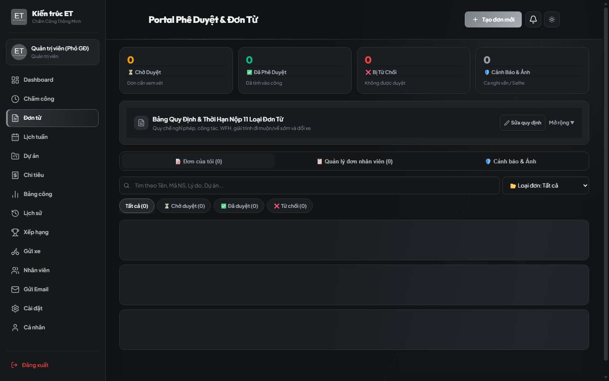
  <p><em>Hình 4: Trung tâm Đơn từ & Phê duyệt giải trình ca chấm công</em></p>
</div>

Hệ thống hỗ trợ **11 loại đơn điện tử** có mẫu hướng dẫn chi tiết:

| Loại Đơn | Mục Đích Sử Dụng | Yêu Cầu / Lưu Ý |
|---|---|---|
| **Nghỉ phép năm (P)** | Nghỉ có lương trừ vào quỹ phép năm | Nộp trước tối thiểu 1 ngày |
| **Nghỉ ốm / Chế độ (O)** | Nghỉ do ốm đau, thai sản, cưới hỏi | Bổ sung giấy tờ/ảnh chụp viện |
| **Làm việc từ xa (WFH)** | Làm việc tại nhà | Nêu rõ đầu việc sẽ hoàn thành |
| **Công tác ngoài (Site/Client)** | Đi gặp khách hàng, công trường | Tự động ghi nhận công ngoài văn phòng |
| **Quên chấm công (Giải trình)** | Bổ sung giờ khi quên bấm máy | Trong vòng 03 ngày làm việc |
| **Đi muộn / Về sớm** | Có việc đột xuất được Leader đồng ý | Nêu rõ lý do và thời gian xin phép |
| **Tăng ca làm thêm (OT)** | Làm ngoài giờ sau 17:30 hoặc cuối tuần | Leader/Admin duyệt tính hệ số lương |
| **Nghỉ không lương (KL)** | Nghỉ khi đã hết quỹ phép năm | Cần thỏa thuận trước với cấp quản lý |

- **Thao tác:** Vào mục **Đơn từ** -> Bấm **+ Tạo đơn mới** -> Chọn loại đơn -> Điền ngày/giờ & lý do -> Bấm **Gửi phê duyệt**.
- **Theo dõi:** Trạng thái đơn được cập nhật real-time: `Chờ duyệt` ⏳ ➔ `Đã duyệt` ✅ ➔ `Từ chối` ❌.

---

### MODULE 3: LỊCH TUẦN TTS & PHÂN CÔNG TRỰC NHẬT

<div align="center">
  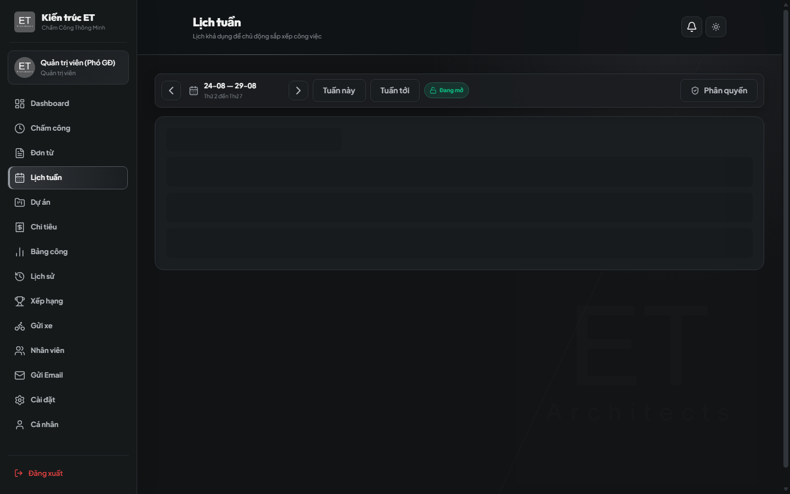
  <p><em>Hình 5: Bảng Đăng ký Lịch tuần TTS & Phân công Trực nhật vệ sinh tự động</em></p>
</div>

- **Đối với Thực tập sinh (TTS):**
  - Đăng ký ca làm việc dự kiến của tuần tiếp theo (Sáng / Chiều / Cả ngày).
  - ⏰ **Thời hạn:** Hệ thống tự động **khóa đăng ký vào 23:59 Chủ Nhật hàng tuần**.
- **Bảng Phân Công Trực Nhật & Vệ Sinh:**
  - Hệ thống tự động xếp lịch trực nhật theo tuần dựa trên sĩ số có mặt.
  - Bấm vào tên đồng nghiệp trực nhật để xem popup thông tin liên hệ / phòng ban khi cần bàn giao.

---

### MODULE 4: QUẢN LÝ DỰ ÁN & TIẾN ĐỘ

<div align="center">
  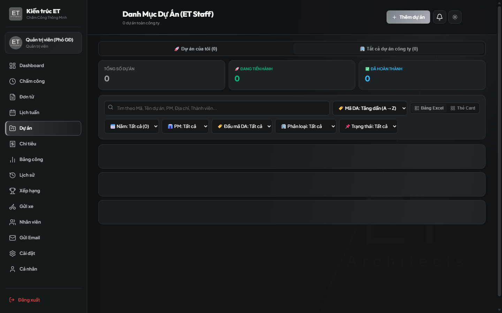
  <p><em>Hình 6: Bảng Theo dõi Dự án, Công trình & Phân quyền cập nhật tiến độ cho PM</em></p>
</div>

- **Nhân viên tham gia:** Xem danh sách dự án, công trình, khách hàng và vai trò được phân công.
- **Phụ trách dự án (PM):** Được cấp quyền độc quyền cập nhật:
  - Tiến độ dự án (% hoàn thành).
  - Trạng thái: Đang chuẩn bị / Đang thi công / Hoàn thành / Tạm dừng.
  - Ghi chú công việc và điều chỉnh deadline.

---

### MODULE 5: CHI TIÊU & HOÀN ỨNG CÔNG TÁC

<div align="center">
  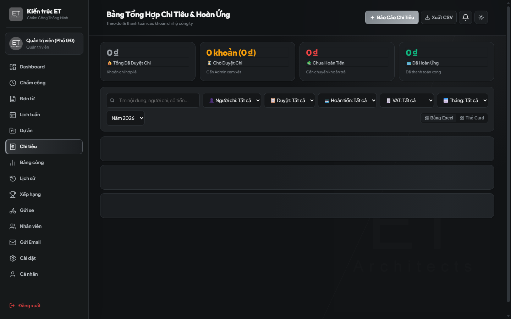
  <p><em>Hình 7: Bảng Tổng hợp Chi tiêu, Tải hóa đơn & Theo dõi Hoàn ứng công tác</em></p>
</div>

Dành cho nhân sự mua sắm vật tư, tiếp khách, công tác phí cần công ty hoàn trả:
1. Vào mục **Chi tiêu** -> Bấm **+ Tạo khoản chi**.
2. Nhập số tiền, phân loại, nội dung chi và **tải ảnh hóa đơn / chứng từ thanh toán**.
3. **Quy trình giải ngân:**
   - Leader duyệt nội dung chi.
   - Admin kiểm tra số tài khoản ngân hàng của bạn (qua popup thông tin) -> Chuyển khoản hoàn ứng -> Đánh dấu **Đã hoàn ứng** trên hệ thống.

---

### MODULE 6: BẢNG CHẤM CÔNG MATRIX & KÝ HIỆU CHUẨN

<div align="center">
  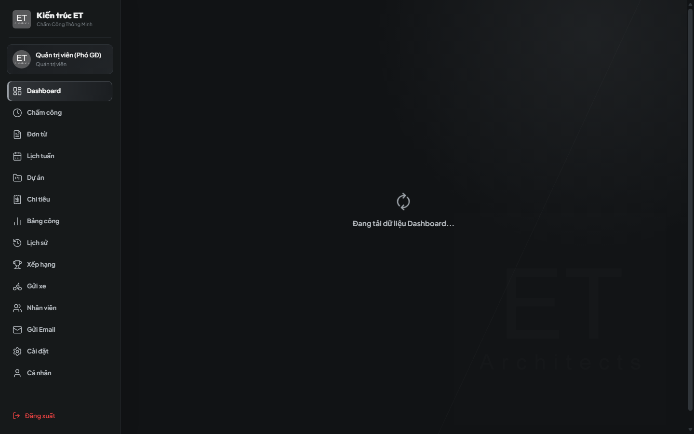
  <p><em>Hình 8: Ma trận Chấm công toàn công ty & Xuất báo cáo Excel / PDF chuyên nghiệp</em></p>
</div>

Theo dõi kết quả công cả tháng của toàn công ty dạng bảng ma trận:

| Ký Hiệu | Ý Nghĩa | Quy Đổi Ngày Công |
|:---:|---|:---:|
| **x** | Đi làm đầy đủ cả ngày (8 tiếng) | **1.0 công** |
| **0.5x** | Đi làm nửa ngày (Sáng hoặc Chiều) | **0.5 công** |
| **0.75x** | Đi làm 6 tiếng (đi muộn / về sớm có phép) | **0.75 công** |
| **WFH** | Làm việc tại nhà có phê duyệt | **1.0 công** |
| **CT1 / Site** | Đi công tác, giám sát công trường | **1.0 công** |
| **P** | Nghỉ phép năm hưởng nguyên lương | **1.0 công** |
| **KL** | Nghỉ không hưởng lương | **0 công** |
| **OFF** | Nghỉ lễ / Nghỉ cuối tuần theo quy định | — |

---

### MODULE 7: LỊCH SỬ CHẤM CÔNG & ĐIỀU CHỈNH GIỜ

<div align="center">
  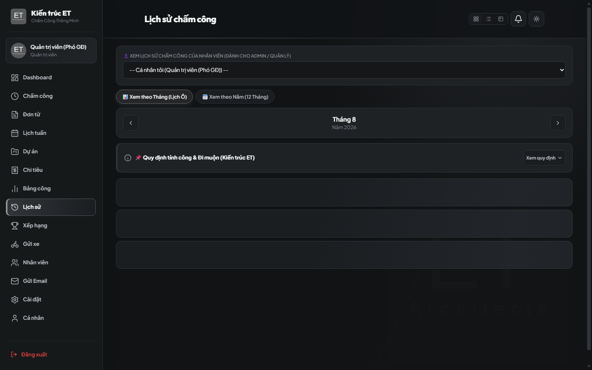
  <p><em>Hình 9: Xem Lịch sử Chấm công dạng Lịch Tháng (Calendar View) & Stepper điều chỉnh giờ</em></p>
</div>

- Xem dạng **Lịch tháng (Calendar View)** hoặc danh sách chi tiết từng ngày.
- Xem giờ vào, giờ ra, số phút muộn, thời gian tăng ca và trạng thái duyệt.
- Dành cho Admin: Hỗ trợ bộ điều chỉnh công nhanh **(±15 phút)** khi có sự cố kỹ thuật.

---

### MODULE 8: BẢNG XẾP HẠNG CHUYÊN CẦN & THI ĐUA

<div align="center">
  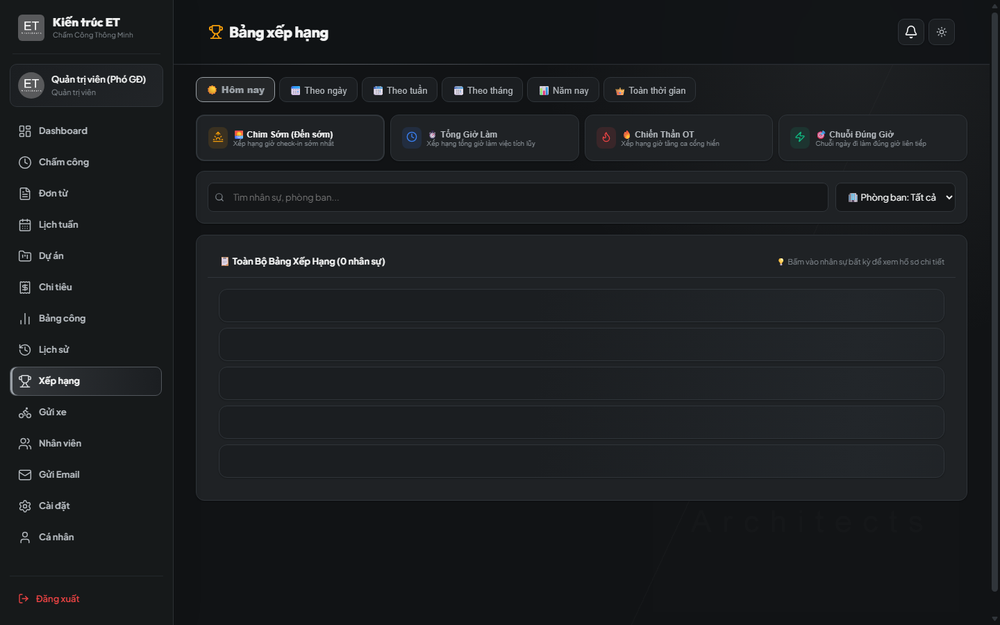
  <p><em>Hình 10: Bảng Vinh danh Chuyên cần — Thi đua Đi đúng giờ theo Hôm nay / Tuần / Tháng</em></p>
</div>

- Vinh danh Top nhân sự đi làm đúng giờ, tác phong gương mẫu.
- Bộ lọc linh hoạt: **Hôm nay** / **Tuần này** / **Tháng này**.
- Tạo động lực thi đua văn hóa văn phòng chuyên nghiệp.

---

### MODULE 9: QUẢN LÝ PHƯƠNG TIỆN & GỬI XE

<div align="center">
  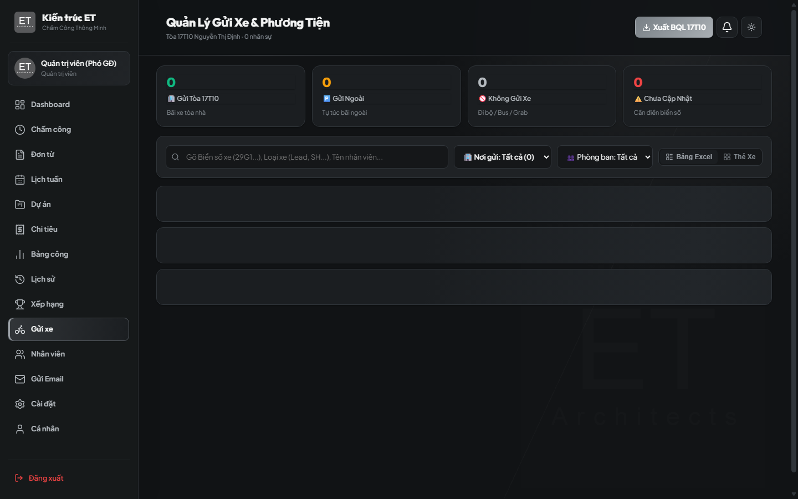
  <p><em>Hình 11: Bảng Quản lý Phương tiện xe cộ — Đăng ký vé gửi xe tháng tại tòa nhà</em></p>
</div>

- Nhân viên cập nhật thông tin phương tiện: **Biển số xe**, **Loại xe (Tay ga / Xe số / Ô tô / Xe điện)**, **Màu xe**.
- Admin duyệt danh sách để đăng ký vé xe tháng với Ban quản lý tòa nhà, tránh mất mát và nhầm lẫn phương tiện.

---

### MODULE 10: THÔNG TIN CÁ NHÂN, NGÂN HÀNG & THIẾT BỊ

<div align="center">
  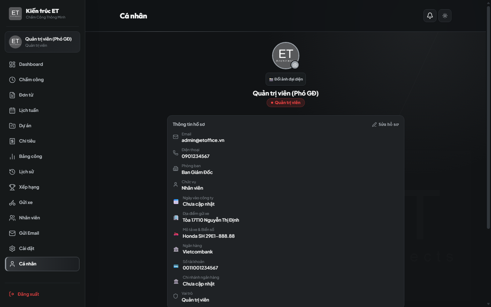
  <p><em>Hình 12: Trang Thông tin Hồ sơ Cá nhân, Tài khoản Ngân hàng & Quản lý Máy chính chủ</em></p>
</div>

- Cập nhật số điện thoại, ngày sinh, địa chỉ.
- **Thông tin ngân hàng:** Bắt buộc nhập chính xác **Tên ngân hàng + Số tài khoản + Chủ tài khoản** để phục vụ chi trả lương và hoàn ứng chi tiêu.
- **Danh sách thiết bị:** Xem máy đang đăng nhập, yêu cầu Admin gắn cờ **`⭐ MÁY CHÍNH`** để check-in 1 chạm không cần selfie.

---

## 5. QUY TRÌNH DÀNH CHO LEADER & ADMIN

```
                         QUY TRÌNH DUYỆT ĐƠN & KHÓA SỔ
 ┌────────────────┐      ┌────────────────────────┐      ┌───────────────────────┐
 │ Nhân viên nộp  │ ───> │ Leader / Admin duyệt   │ ───> │ Admin chốt công tháng │
 │ đơn / Giải trình│      │ (Tự động trừ/cộng công)│      │ (Khóa sổ chống sửa)   │
 └────────────────┘      └────────────────────────┘      └───────────────────────┘
```

1. **Duyệt ca cảnh báo & Selfie:**
   - Vào mục *Đơn từ & Cảnh báo* -> Tab *Ca cảnh báo / Selfie*.
   - Kiểm tra ảnh và vị trí -> Bấm **Duyệt** (tự động trust thiết bị) hoặc **Từ chối** (có thể chọn *"Xóa để nhân viên chấm lại"*).
2. **Duyệt đơn từ & Hoàn tác (Revert):**
   - Phê duyệt đơn nghỉ phép: Hệ thống tự động kiểm tra số dư phép và trừ ngày công.
   - Nếu duyệt nhầm: Bấm nút **Hoàn tác (Revert)** -> Đơn quay lại chờ duyệt và hoàn nguyên ngày phép ngay lập tức.
3. **Chốt công tháng (Timesheet Lock):**
   - Vào ngày cuối tháng/đầu tháng sau, Admin kiểm tra dữ liệu và bấm **Khóa bảng công**. Sau khi khóa, không ai có thể tự ý sửa đổi dữ liệu.
4. **Xuất báo cáo Excel / PDF:**
   - Xuất file Excel chấm công chi tiết có đầy đủ cột OT, phút đi muộn, chi tiết tài khoản ngân hàng để chuyển giao kế toán tính lương.

---

## 6. CẨM NANG XỬ LÝ SỰ CỐ THƯỜNG GẶP (FAQ)

### ❓ 1. Ứng dụng báo: "Vị trí nằm ngoài phạm vi cho phép (Cách ...m)"
- **Nguyên nhân:** Điện thoại đang tắt GPS, đang bật chế độ tiết kiệm pin hoặc tín hiệu GPS bị trôi.
- **Khắc phục:**
  1. Bật GPS trên điện thoại -> Mở Google Maps để máy định vị lại vị trí thực tế.
  2. Bấm nút **Cập nhật lại vị trí** trên app portal.
  3. Nếu vẫn không được: Chụp ảnh màn hình làm bằng chứng -> Chọn mục *Công tác ngoài* hoặc gửi *Đơn giải trình*.

### ❓ 2. Tại sao lần nào bấm Check-in cũng bắt chụp ảnh Selfie?
- **Nguyên nhân:** Thiết bị của bạn chưa được Admin xác thực là Máy chính chủ (`is_trusted = true`).
- **Khắc phục:** Nhờ Quản lý (Leader) hoặc Admin vào mục **Nhân sự** -> Chi tiết nhân viên -> Đặt thiết bị của bạn làm **`⭐ MÁY CHÍNH`**.

### ❓ 3. Đã quên chấm công sáng nay, bây giờ phải làm sao?
- Bấm chấm công chiều như bình thường.
- Vào mục **Đơn từ** -> Tạo đơn **Quên chấm công (Giải trình)** -> Chọn ngày hôm nay -> Điền giờ vào thực tế và lý do để Quản lý phê duyệt bù công.

### ❓ 4. Thay đổi điện thoại mới thì cần làm gì?
- Đăng nhập vào điện thoại mới.
- Thực hiện chấm công kèm chụp ảnh selfie xác thực ở lần đầu tiên.
- Báo Admin xóa thiết bị cũ và kích hoạt thiết bị mới làm máy chính.

---

*Chúc toàn thể anh chị em có trải nghiệm làm việc tiện lợi, chính xác và hiệu quả cùng ET Office Portal!*  
*Mọi ý kiến đóng góp xin vui lòng gửi về hòm thư hỗ trợ quản trị nội bộ.*
