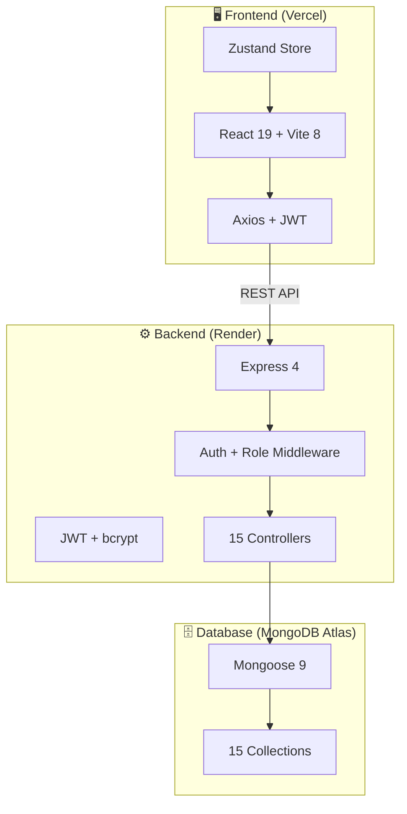

<p align="center">
  
  
  
  
  
</p>

# 🏢 ET Office Portal

> **Hệ thống quản lý chấm công thông minh** dành cho doanh nghiệp vừa và nhỏ (~20–50 nhân viên).
> Mobile-first PWA · GPS Geofencing · Báo cáo PDF · Dashboard thời gian thực

---

## ✨ Tính năng chính

### 📱 Chấm Công Thông Minh
- **Check-in / Check-out** qua GPS với geofencing (bán kính tuỳ chỉnh)
- Hỗ trợ **nhiều loại hình làm việc**: Văn phòng, Công tác trong nước/ngoài nước, Work From Home
- **Chống gian lận**: Device fingerprint + GPS validation
- Tự động tính **đi trễ / về sớm** theo ca làm việc

### 📊 Dashboard & Báo cáo
- Dashboard tổng quan theo thời gian thực (Admin/Leader)
- **Bảng chấm công matrix** 31 ngày theo tháng (toàn công ty, render 2150px không bị xén ngày)
- **Bảng Chi Tiết Chấm Công Cá Nhân** (gộp giờ Vào/Ra, Loại Công, badge Đủ Công Ngày, Giờ làm & OT ngày)
- Xuất **PDF A4 sắc nét 2.5x–3x** (offscreen high-def renderer)
- Xuất **Excel** (xlsx) báo cáo chấm công
- Tự động lưu & đồng bộ **Logo doanh nghiệp** tức thì trên giao diện và trang Đăng Nhập

### 📋 Quản Lý Đơn Từ
- Tạo đơn: Nghỉ phép (P), Nghỉ ốm (O), Nghỉ không lương (KL), OT, WFH, Công tác, Giải trình, Khác
- Workflow duyệt/từ chối: Admin & Leader
- Thông báo real-time khi đơn được xử lý

### 👥 Quản Lý Nhân Sự
- CRUD nhân viên (tên, email, SĐT, vai trò, phòng ban)
- **1 nhân viên có thể thuộc nhiều phòng ban** (multi-department)
- Quản lý ngày phép theo năm
- Reset mật khẩu bằng mã code (Admin tạo)

### 🔒 Chốt Công (Timesheet Lock)
- Admin chốt bảng công theo tháng — nhân viên không thể sửa sau khi chốt
- Lưu lịch sử sửa đổi kèm lý do

### ⚙️ Cài Đặt Hệ Thống
- Cấu hình giờ làm việc (bắt đầu, kết thúc, giờ OT)
- Quản lý vị trí GPS văn phòng + bán kính geofence
- Quản lý ngày lễ / ngày nghỉ
- Quản lý phòng ban & dự án

---

## 🏗️ Kiến trúc hệ thống



---

## 🔐 Phân quyền (3 Roles)

| Vai trò | Giá trị DB | Menu truy cập | Chức năng chính |
|---------|-----------|---------------|-----------------|
| 👑 **Admin** | `admin` | Tất cả | Quản lý toàn bộ NV, cài đặt hệ thống, chốt công, duyệt đơn, xuất báo cáo |
| ⭐ **Leader** | `leader` | Dashboard, Báo cáo, Đơn từ, Lịch sử, Dự án, Nhân viên | Xem sĩ số team, duyệt/từ chối đơn, quản lý dự án |
| 👤 **Nhân viên** | `employee` | Chấm công, Đơn từ, Lịch sử, Cá nhân | Check-in/out GPS, tạo đơn, xem lịch sử cá nhân |

> **Backward compatible**: Legacy roles `manager` và `staff` vẫn hoạt động bình thường.

---

## 🚀 Cài đặt & Chạy dự án

### Yêu cầu
- **Node.js** >= 18.x
- **npm** >= 9.x
- **MongoDB Atlas** (hoặc MongoDB local)

### Bước 1: Clone repository

```bash
git clone https://github.com/hocjsoo/qly-cham-cong.git
cd qly-cham-cong
```

### Bước 2: Cài đặt dependencies

```bash
# Backend
cd server && npm install

# Frontend
cd ../client && npm install
```

### Bước 3: Cấu hình environment

```bash
cp server/.env.example server/.env
```

Chỉnh sửa `server/.env`:

```env
PORT=5000
MONGODB_URI=mongodb+srv://<user>:<pass>@<cluster>.mongodb.net/et-office
JWT_SECRET=your-super-secret-key-here
JWT_EXPIRES_IN=7d
OFFICE_LAT=10.7769
OFFICE_LNG=106.7009
OFFICE_RADIUS_METERS=100
```

### Bước 4: Khởi động

```bash
# Terminal 1 — Backend (API + Auto-seed)
cd server && npm run dev

# Terminal 2 — Frontend (Dev server)
cd client && npm run dev
```

| Service | URL |
|---------|-----|
| 🖥️ Frontend | http://localhost:5173 |
| ⚙️ Backend API | http://localhost:5000 |
| 🩺 Health Check | http://localhost:5000/api/health |

### Bước 5 (Tuỳ chọn): Chia sẻ qua Internet

```bash
npx localtunnel --port 5000
```

---

## 🔑 Tài khoản Admin khởi tạo (Initial Admin)

Khi hệ thống chạy lần đầu tiên trên cơ sở dữ liệu mới, tài khoản Admin sẽ tự động được khởi tạo theo thông tin cấu hình trong `server/.env`:

```env
INITIAL_ADMIN_EMAIL=admin@company.com
INITIAL_ADMIN_PASSWORD=YourSecurePassword123
```

> ⚠️ **Lưu ý bảo mật**: Đổi mật khẩu ngay sau lần đăng nhập đầu tiên để đi vào vận hành chính thức!

---

## 📡 API Endpoints

### Authentication
| Method | Endpoint | Mô tả | Auth |
|--------|----------|-------|------|
| `POST` | `/api/auth/login` | Đăng nhập | ❌ |
| `POST` | `/api/auth/register` | Tạo tài khoản mới | Admin/Leader |
| `GET` | `/api/auth/me` | Thông tin user hiện tại | ✅ |
| `POST` | `/api/auth/forgot-password` | Tạo mã reset password | Admin/Leader |
| `POST` | `/api/auth/reset-password` | Đặt lại mật khẩu | ❌ |
| `PUT` | `/api/auth/change-password` | Đổi mật khẩu | ✅ |
| `PUT` | `/api/auth/profile` | Cập nhật thông tin cá nhân | ✅ |

### Chấm Công
| Method | Endpoint | Mô tả | Auth |
|--------|----------|-------|------|
| `POST` | `/api/attendance/checkin` | Check-in GPS | ✅ |
| `POST` | `/api/attendance/checkout` | Check-out | ✅ |
| `GET` | `/api/attendance/today` | Trạng thái hôm nay | ✅ |
| `GET` | `/api/attendance/history` | Lịch sử chấm công | ✅ |
| `PUT` | `/api/attendance/override/:id` | Admin sửa giờ công | Admin/Leader |

### Đơn Từ
| Method | Endpoint | Mô tả | Auth |
|--------|----------|-------|------|
| `GET` | `/api/requests` | Danh sách đơn cá nhân | ✅ |
| `POST` | `/api/requests` | Tạo đơn mới | ✅ |
| `GET` | `/api/requests/pending` | Đơn chờ duyệt | Admin/Leader |
| `PUT` | `/api/requests/:id/approve` | Duyệt đơn | Admin/Leader |
| `PUT` | `/api/requests/:id/reject` | Từ chối đơn | Admin/Leader |

### Dashboard & Báo Cáo
| Method | Endpoint | Mô tả | Auth |
|--------|----------|-------|------|
| `GET` | `/api/dashboard/today` | Dashboard hôm nay | Admin/Leader |
| `GET` | `/api/dashboard/pending-count` | Số đơn chờ duyệt | Admin/Leader |
| `GET` | `/api/reports/matrix` | Bảng chấm công matrix | Admin/Leader |
| `GET` | `/api/reports/individual-detail` | Chi tiết công cá nhân | Admin/Leader |
| `GET` | `/api/export/excel` | Xuất Excel | Admin/Leader |

### Quản Lý
| Method | Endpoint | Mô tả | Auth |
|--------|----------|-------|------|
| `GET/POST/PUT/DELETE` | `/api/users` | CRUD nhân viên | Admin/Leader |
| `GET/POST/PUT/DELETE` | `/api/departments` | CRUD phòng ban | ✅ |
| `GET/POST/PUT/DELETE` | `/api/projects` | CRUD dự án | Mixed |
| `GET/POST/PUT/DELETE` | `/api/locations` | CRUD vị trí GPS | Admin |
| `GET` | `/api/settings` | Tải Logo & Tên Công Ty | ❌ (Public) |
| `PUT` | `/api/settings` | Cập nhật logo & cấu hình hệ thống | Admin |
| `GET/POST/DELETE` | `/api/holidays` | CRUD ngày lễ | Admin/Leader |
| `GET/PUT` | `/api/leave-balance` | Quản lý ngày phép | Admin/Leader |
| `GET/POST/PUT` | `/api/corrections` | Yêu cầu sửa công | Mixed |
| `GET/POST` | `/api/timesheet-lock` | Chốt/mở công | Admin/Leader |
| `GET/POST` | `/api/notifications` | Thông báo | Mixed |
| `GET` | `/api/health` | Health check | ❌ |

---

## 🌐 Deployment

### Frontend → Vercel

1. Import repository trên [vercel.com](https://vercel.com)
2. Cấu hình:
   - **Root Directory**: `client`
   - **Build Command**: `npm run build`
   - **Output Directory**: `dist`
   - **Framework Preset**: Vite
3. Thêm environment variable:
   - `VITE_API_URL` = URL của backend trên Render

### Backend → Render.com

1. Tạo Web Service trên [render.com](https://render.com)
2. Cấu hình:
   - **Root Directory**: `server`
   - **Build Command**: `npm install`
   - **Start Command**: `npm start`
   - **Environment**: Node
3. Thêm environment variables (xem `.env.example`)

---

## 🛠️ Tech Stack

| Layer | Công nghệ | Phiên bản |
|-------|-----------|-----------|
| **Frontend** | React | 19.x |
| **Build Tool** | Vite | 8.x |
| **State** | Zustand | 5.x |
| **HTTP** | Axios | 1.x |
| **Charts** | Recharts | 3.x |
| **Icons** | Lucide React | 1.x |
| **PDF** | jsPDF + html2canvas | 4.x / 1.x |
| **Backend** | Express | 4.x |
| **Database** | MongoDB Atlas + Mongoose | 9.x |
| **Auth** | JWT + bcrypt | — |
| **Excel** | SheetJS (xlsx) | 0.18.x |
| **Linter** | oxlint | 1.x |

---

## 📂 Ký hiệu chấm công

| Ký hiệu | Ý nghĩa | Giá trị công |
|----------|---------|--------------|
| `x` | Đủ công | 1.0 |
| `0.75x` | 3/4 công | 0.75 |
| `0.5x` | 1/2 công | 0.5 |
| `CT1` | Công tác trong nước | — |
| `CT2` | Công tác nước ngoài | — |
| `WFH` | Work From Home | — |
| `P` | Nghỉ phép | — |
| `O` | Nghỉ ốm | — |
| `KL` | Nghỉ không lương | — |
| `K` | Khác | — |

---

## 🤝 Đóng góp

Xem [CONTRIBUTING.md](CONTRIBUTING.md) để biết quy trình đóng góp code.

## 📄 License

Dự án được phân phối theo giấy phép [MIT License](LICENSE).

---

<p align="center">
  <sub>Built with ❤️ by <a href="https://github.com/hocjsoo">ET Architects Team</a></sub>
</p>
