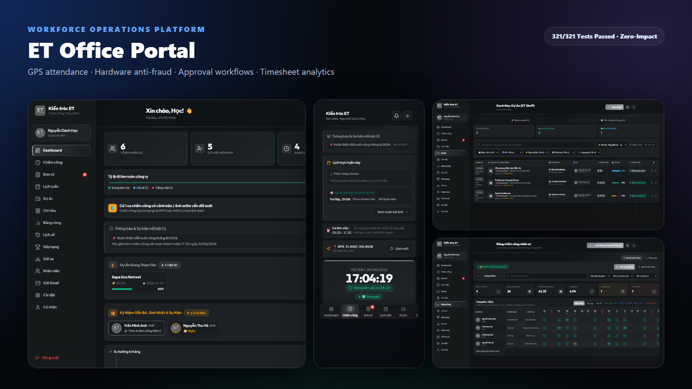

<p align="center">
  
  
  
  
  
  
  
  
</p>

# 🏢 ET Office Portal

> **Hệ thống quản lý chấm công thông minh, định vị GPS, chống gian lận đa tầng & vận hành doanh nghiệp toàn diện**, được thiết kế & phát triển độc quyền bởi **Nguyễn Danh Học** ([@hocjsoo](https://github.com/hocjsoo)).
> 
> *Mobile-first PWA · GPS Geofencing · Hardware Fingerprinting Anti-Fraud · Phê Duyệt Đơn Từ & Hoàn Phép Thông Minh · Quản Lý Dự Án & Phương Tiện · Báo Cáo Matrix 31 Ngày & Xuất File PDF/Excel*

---

<p align="center">
  
</p>

---

## 📑 Mục lục

1. [Tổng Quan Hệ Thống](#-tổng-quan-hệ-thống)
2. [Bộ Sưu Tập Giao Diện (Screenshots)](#-bộ-sưu-tập-giao-diện-screenshots)
3. [Tính Năng Nổi Bật](#-tính-năng-nổi-bật)
4. [Kiến Trúc Kỹ Thuật (Architecture)](#-kiến-trúc-kỹ-thuật-architecture)
5. [Phân Quyền Hệ Thống (RBAC Matrix)](#-phân-quyền-hệ-thống-rbac-matrix)
6. [Bảo Mật & Anti-Fraud Đa Tầng](#-bảo-mật--anti-fraud-đa-tầng)
7. [Danh Mục API Endpoints](#-danh-mục-api-endpoints)
8. [Hệ Thống Kiểm Thử (40 Suites / 321 Tests)](#-hệ-thống-kiểm-thử-40-suites--321-tests)
9. [Hướng Dẫn Cài Đặt & Khởi Chạy](#-hướng-dẫn-cài-đặt--khởi-chạy)
10. [Cấu Trúc Thư Mục Dự Án](#-cấu-trúc-thư-mục-dự-án)
11. [Tài Liệu Liên Quan](#-tài-liệu-liên-quan)
12. [Bản Quyền & Tác Giả](#-bản-quyền--tác-giả)

---

## 🌟 Tổng Quan Hệ Thống

**ET Office Portal** là giải pháp phần mềm quản trị doanh nghiệp toàn diện dành cho quy mô 30–100+ nhân sự, giải quyết triệt để bài toán chấm công hỗn hợp (Văn phòng, Công trình, Khách hàng, Làm từ xa) và quy trình vận hành nội bộ theo chuẩn mực hiện đại.

- **Frontend**: React 19 + Vite 8 + Tailwind/Vanilla CSS Design System + Zustand + Lucide Icons + Leaflet GPS Picker.
- **Backend**: Node.js 20+ + Express 4 + Mongoose 9 + JWT + bcrypt + ExcelJS / PDFKit.
- **Database**: MongoDB Atlas (Cloud) với kiến trúc Data Isolation & Multi-tenant Indexing.
- **Testing Engine**: 40 Test Suites / 321 Test Cases tự động (Zero-Impact In-Memory & Supertest Pipeline).

---

## 📸 Bộ Sưu Tập Giao Diện (Screenshots)

| Màn Hình Đăng Nhập | Dashboard Quản Trị Tổng Quan |
|:---:|:---:|
|  |  |
| *Xác thực JWT đa tầng, ghi nhớ thiết bị & khôi phục mật khẩu* | *Thống kê sĩ số realtime, biểu đồ chuyên cần & việc cần xử lý* |

| Chấm Công Mobile PWA | Chấm Công Desktop + GPS Map |
|:---:|:---:|
|  |  |
| *Giao diện Mobile-first PWA, nhận diện vị trí và ca làm việc* | *Bản đồ Leaflet Geofencing, phát hiện thiết bị & Selfie xác thực* |

| Quản Lý Đơn Từ & Phê Duyệt | Lịch Làm Việc Tuần (TTS Schedule) |
|:---:|:---:|
|  |  |
| *Duyệt đơn đa cấp, hoàn phép tự động, cảnh báo thiết bị lạ* | *Đăng ký ca làm việc linh hoạt, lịch trực tuần & phân ca thông minh* |

| Quản Lý Dự Án & Công Trình | Quản Lý Chi Tiêu & Hoàn Ứng |
|:---:|:---:|
|  |  |
| *Phân quyền Project Manager, theo dõi tiến độ, Geofencing công trình* | *Theo dõi dòng tiền, tạm ứng, hoàn ứng & duyệt chi minh bạch* |

| Báo Cáo Matrix 31 Ngày | Lịch Sử Chấm Công Cá Nhân |
|:---:|:---:|
|  |  |
| *Ma trận chấm công 31 ngày chuẩn xác, chốt công & xuất Excel/PDF* | *Lịch sử chi tiết từng ngày, timeline vào/ra & bộ điều chỉnh giờ công* |

| Bảng Xếp Hạng Chuyên Cần | Bảng Phương Tiện & Gửi Xe |
|:---:|:---:|
|  |  |
| *Vinh danh nhân viên gương mẫu theo Ngày / Tuần / Tháng* | *Quản lý vé xe Tòa nhà 17T10, biển số & quy trình đổi xe* |

| Quản Lý Nhân Sự & Thiết Bị | Hồ Sơ Cá Nhân & Đổi Mật Khẩu |
|:---:|:---:|
|  |  |
| *Danh sách nhân viên, gán máy chính chủ & quản lý quyền hạn* | *Cập nhật thông tin, đổi mật khẩu bảo mật & đăng ký xe* |

---

## ✨ Tính Năng Nổi Bật

### 📱 1. Chấm Công Đa Hình Thức & GPS Geofencing
- **Linh hoạt 4 chế độ**: Văn phòng (Office), Công trường (Site), Gặp khách hàng (Client), Làm việc từ xa (WFH).
- **Tính toán Geofencing chuẩn xác**: Sử dụng công thức Haversine tính khoảng cách theo mét thực tế, hỗ trợ nhiều chi nhánh văn phòng đồng thời.
- **Tự động phân loại ca làm**:
  - Tự động nhận diện đi muộn theo 4 mức (Level 1: 1-15p, Level 2: 16-30p, Level 3: 31-60p, Level 4: >60p).
  - Tự động tính giờ tăng ca (OT) sau 18:30 và ngày cuối tuần/ngày lễ.
  - Xử lý chuẩn xác múi giờ `Asia/Ho_Chi_Minh` (UTC+7).

### 🛡️ 2. Anti-Fraud Chữ Ký Phần Cứng & Trung Tâm Cảnh Báo
- **Chữ ký phần cứng vật lý (`pure_hardware_uuid`)**:
  - Mã hoá tổng hợp từ GPU WebGL unmasked renderer, số nhân CPU, độ phân giải màn hình, audio context sample rate và timezone.
  - Ngăn chặn việc gian lận chấm công hộ qua Tab ẩn danh (Incognito) hoặc đổi trình duyệt trên cùng 1 máy tính.
- **Tự động bắt chụp ảnh Selfie xác thực**: Khi phát hiện thiết bị lạ hoặc nhiều tài khoản đăng nhập trên cùng một phần cứng.
- **Trung tâm duyệt cảnh báo (Verification Center)**:
  - Bộ lọc: *Chờ duyệt, Thiết bị lạ, Kèm ảnh Selfie, Đã duyệt, Từ chối*.
  - Duyệt 1-chạm: Tự động đánh dấu và lưu thiết bị thành **`⭐ Máy chính chủ`** (`is_trusted = true`).
  - Từ chối thông minh kèm tùy chọn **"Xóa dữ liệu để nhân viên chấm công lại"**.

### 📋 3. Quản Lý Đơn Từ & Hoàn Phép Tự Động
- Hỗ trợ đầy đủ loại đơn: Nghỉ phép năm (P), Nghỉ ốm (O), Nghỉ không lương (KL), Tăng ca (OT), Làm từ xa (WFH), Đi công tác (CT), Giải trình chấm công, Đổi xe...
- **Phân quyền phê duyệt đa tầng**: Leader chỉ được duyệt đơn của nhân viên thuộc phòng ban mình quản lý, không được duyệt đơn của Admin.
- **Cơ chế Transaction Rollback & Hoàn phép**: Khi đơn bị từ chối hoặc hoàn tác (`revert`), hệ thống tự động cộng trả lại ngày phép và trừ giờ OT tương ứng.
- **Tích hợp hộp thoại xác nhận (`ConfirmDialog`)**: Tránh thao tác nhầm lẫn khi duyệt/hủy đơn.

### 🏗️ 4. Quản Lý Dự Án & Phân Quyền PM
- **Admin**: Toàn quyền tạo mới, phân công, chỉnh sửa và xóa dự án.
- **Project Manager (PM)**: Được quyền cập nhật tiến độ, deadline, trạng thái và thông tin của dự án mình được giao phụ trách.
- Hỗ trợ 2 giao diện trực quan: **Bảng Excel Dữ Liệu** và **Thẻ Card Tiến Độ**.

### 🛵 5. Bảng Phương Tiện & Gửi Xe Tinh Gọn
- Quản lý biển số xe, dòng xe, nơi gửi xe (Tòa 17T10 / Gửi ngoài / Không dùng xe).
- Giao diện bảng được tinh gọn tối đa; chỉ Admin mới có quyền phê duyệt và sửa thông tin vé xe.

### 📊 6. Báo Cáo Matrix 31 Ngày & Xuất Báo Cáo
- Bảng ma trận chấm công 31 ngày hiển thị trực quan toàn bộ trạng thái công trong tháng của doanh nghiệp.
- **Chốt công tháng (Timesheet Lock)**: Admin có thể khóa dữ liệu công sau khi đã đối soát để tránh sửa đổi ngoài ý muốn.
- Xuất file báo cáo đa định dạng: **PDF A4 Vector chuẩn in ấn** và **Excel (.xlsx)** định dạng chuyên nghiệp.

---

## 🏗️ Kiến Trúc Kỹ Thuật (Architecture)

```
                              ┌──────────────────────────────────┐
                              │      Client: React 19 (Vite 8)   │
                              │  - PWA / Mobile-first Responsive │
                              │  - Zustand State Management       │
                              │  - Pure Hardware Fingerprint     │
                              │  - Leaflet GPS Map Picker        │
                              └────────────────┬─────────────────┘
                                               │
                                      HTTPS / REST API (JWT)
                                               │
                              ┌────────────────▼─────────────────┐
                              │     Server: Node.js / Express 4  │
                              │  - Auth & Role Middleware (RBAC) │
                              │  - Anti-Fraud & Verification     │
                              │  - Business Controllers (15)     │
                              │  - ExcelJS & PDF Generator       │
                              └────────────────┬─────────────────┘
                                               │
                                         Mongoose 9 ODM
                                               │
                              ┌────────────────▼─────────────────┐
                              │       Database: MongoDB Atlas    │
                              │  - Users & Device Registry       │
                              │  - Attendances & Timesheets      │
                              │  - Requests & Leave Balances     │
                              │  - Projects & Expenses           │
                              └──────────────────────────────────┘
```

---

## 🔐 Phân Quyền Hệ Thống (RBAC Matrix)

| Chức năng | Admin | Leader (Trưởng phòng) | PM (Quản lý dự án) | Employee (Nhân viên) |
|---|:---:|:---:|:---:|:---:|
| Chấm công GPS & Selfie xác thực | ✅ | ✅ | ✅ | ✅ |
| Xem lịch sử chấm công cá nhân | ✅ | ✅ | ✅ | ✅ |
| Nộp & quản lý đơn từ cá nhân | ✅ | ✅ | ✅ | ✅ |
| Duyệt / Từ chối đơn từ nhân viên | ✅ | ✅ *(Chỉ team mình)* | ❌ | ❌ |
| Duyệt ca cảnh báo & Selfie thiết bị lạ | ✅ | ✅ *(Chỉ team mình)* | ❌ | ❌ |
| Đặt / Hủy máy chính chủ (`is_trusted`) | ✅ | ❌ | ❌ | ❌ |
| Điều chỉnh / Xóa giờ chấm công | ✅ *(Duy nhất)* | ❌ | ❌ | ❌ |
| Sửa thông tin gửi xe nhân viên | ✅ *(Duy nhất)* | ❌ | ❌ | ❌ |
| Tạo mới / Xóa dự án | ✅ *(Duy nhất)* | ❌ | ❌ | ❌ |
| Cập nhật tiến độ dự án | ✅ | ❌ | ✅ *(Chỉ DA phụ trách)* | ❌ |
| Chốt công tháng (Timesheet Lock) | ✅ *(Duy nhất)* | ❌ | ❌ | ❌ |
| Cài đặt cấu hình hệ thống | ✅ *(Duy nhất)* | ❌ | ❌ | ❌ |
| Xuất báo cáo Excel / PDF | ✅ | ✅ *(Theo quyền)* | ❌ | ❌ |

---

## 🛡️ Bảo Mật & Anti-Fraud Đa Tầng

1. **Authentication & Token Security**:
   - Xác thực qua JSON Web Token (JWT) trong header `Authorization: Bearer <token>`.
   - Mật khẩu băm an toàn với `bcrypt` (10 salt rounds).
2. **Data Scope Isolation (3-Tier DTO)**:
   - Dữ liệu người dùng được lọc tự động theo vai trò: Admin (Full data), Leader (Team data), Public (Masked data).
   - Ngăn chặn triệt để lộ lọt số CCCD, lương, thông tin bảo mật qua API.
3. **Chống Gian Lận Thiết Bị (Hardware Binding)**:
   - Nhận diện thiết bị vật lý qua hàm băm không thể làm giả.
   - Khi phát hiện thiết bị chưa tin cậy, hệ thống tự động gán cờ `is_flagged = true` và bắt buộc chụp ảnh Selfie.
4. **Bảo Vệ Tầng Mạng & Input Validation**:
   - Rate limiting chống Brute-force & DDoS.
   - Fuzzing & NoSQL Injection sanitization trên toàn bộ input.
   - Transaction Rollback bảo toàn 100% dữ liệu khi xảy ra sự cố giữa chừng.

---

## 📡 Danh Mục API Endpoints

| Endpoint | Method | Auth | Role | Chức năng chính |
|---|:---:|:---:|:---:|---|
| `/api/auth/login` | POST | ❌ | Public | Đăng nhập hệ thống, cấp JWT Token |
| `/api/auth/forgot-password` | POST | ❌ | Public | Yêu cầu gửi OTP khôi phục mật khẩu |
| `/api/auth/reset-password` | POST | ❌ | Public | Đặt lại mật khẩu mới bằng OTP |
| `/api/auth/change-password` | PUT | ✅ | All | Đổi mật khẩu tài khoản đang đăng nhập |
| `/api/attendance/checkin` | POST | ✅ | All | Chấm công vào ca (GPS + Selfie + Fingerprint) |
| `/api/attendance/checkout` | POST | ✅ | All | Chấm công ra ca |
| `/api/attendance/today` | GET | ✅ | All | Lấy trạng thái công ngày hôm nay |
| `/api/attendance/history` | GET | ✅ | All | Lịch sử chấm công cá nhân |
| `/api/attendance/flagged` | GET | ✅ | Admin/Leader | Danh sách ca nghi vấn & chờ duyệt selfie |
| `/api/attendance/flagged/verify/:id` | POST | ✅ | Admin/Leader | Duyệt / Từ chối / Hoàn tác ca cảnh báo |
| `/api/attendance/override/:id` | PUT | ✅ | **Admin only** | Điều chỉnh thủ công giờ vào/ra |
| `/api/attendance/:id` | DELETE | ✅ | **Admin only** | Xóa ca chấm công |
| `/api/requests` | GET/POST | ✅ | All | Lấy danh sách & Tạo đơn từ mới |
| `/api/requests/:id/approve` | PUT | ✅ | Admin/Leader | Phê duyệt đơn từ |
| `/api/requests/:id/reject` | PUT | ✅ | Admin/Leader | Từ chối đơn từ |
| `/api/requests/:id/revert` | PUT | ✅ | Admin/Leader | Hoàn tác đơn về trạng thái chờ duyệt |
| `/api/requests/:id` | DELETE | ✅ | Admin/Leader | Xóa đơn từ an toàn |
| `/api/projects` | GET | ✅ | All | Lấy danh sách dự án |
| `/api/projects` | POST/DELETE | ✅ | **Admin only** | Tạo mới / Xóa dự án |
| `/api/projects/:id` | PUT | ✅ | **Admin / PM** | Cập nhật thông tin dự án |
| `/api/users` | GET/POST/PUT | ✅ | Admin/Leader | Quản lý danh sách nhân sự (3-tier DTO) |
| `/api/users/:id/devices` | GET/PUT/DEL | ✅ | **Admin only** | Quản lý & đặt máy chính chủ cho nhân viên |
| `/api/dashboard` | GET | ✅ | Admin/Leader | Thống kê số liệu Dashboard realtime |
| `/api/reports` | GET | ✅ | **Admin only** | Báo cáo ma trận 31 ngày |
| `/api/export` | GET | ✅ | Admin/Leader | Xuất file Excel báo cáo tổng hợp |
| `/api/timesheet-lock` | GET/POST | ✅ | **Admin only** | Xem trạng thái & Chốt công tháng |
| `/api/settings` | GET/PUT | ✅ | **Admin only** | Xem & Cập nhật cấu hình ca làm việc |
| `/api/health` | GET | ❌ | Public | Healthcheck trạng thái Server & Database |

---

## 🧪 Hệ Thống Kiểm Thử (40 Suites / 321 Tests)

Hệ thống được bảo vệ bởi bộ test tự động chuyên sâu với **40 Test Suites** và **321 Test Cases** chạy theo cơ chế **Zero-Impact In-Memory & Supertest Pipeline** (không ảnh hưởng tới cơ sở dữ liệu thật trên MongoDB Atlas).

```bash
cd server && npm test
```

```
=========================================================================
📊 BÁO CÁO TỔNG KẾT KẾT QUẢ KIỂM THỬ (TEST SUMMARY REPORT)
-------------------------------------------------------------------------
  • Tổng số kịch bản test (Test Cases) : 321
  • Kịch bản ĐẠT (Passed)              : 321
  • Kịch bản LỖI (Failed)              : 0
  • Tỷ lệ thành công (Pass Rate)       : 100%
  • Thời gian thực thi (Execution)     : ~1.1s
  • Cơ sở dữ liệu Prod (MongoDB Atlas) : HOÀN TOÀN NGUYÊN VẸN (0 TÁC ĐỘNG)
=========================================================================
```

Chi tiết kịch bản được mô tả tại [TEST_SCENARIOS.md](./TEST_SCENARIOS.md).

---

## 🚀 Hướng Dẫn Cài Đặt & Khởi Chạy

### Yêu cầu môi trường
- **Node.js**: `>= 18.x` (Khuyến nghị Node.js 20 LTS)
- **npm**: `>= 9.x`
- **MongoDB**: MongoDB Atlas URI hoặc MongoDB Local Community Server

### 1. Clone repository
```bash
git clone https://github.com/hocjsoo/QLY_CHAM_CONG.git
cd QLY_CHAM_CONG
```

### 2. Cài đặt dependencies
```bash
# Cài đặt Backend dependencies
cd server && npm install

# Cài đặt Frontend dependencies
cd ../client && npm install
```

### 3. Cấu hình biến môi trường
Tạo file `server/.env` dựa trên file mẫu:
```env
PORT=5000
NODE_ENV=development
MONGODB_URI=mongodb+srv://<username>:<password>@cluster.mongodb.net/qly_cham_cong
JWT_SECRET=your_super_secret_jwt_key_here
CLIENT_URL=http://localhost:5173
```

Tạo file `client/.env` (nếu cần):
```env
VITE_API_URL=http://localhost:5000/api
```

### 4. Khởi chạy ứng dụng

**Chạy Backend Server:**
```bash
cd server
npm run dev
# Server lắng nghe tại http://localhost:5000
```

**Chạy Frontend Client:**
```bash
cd client
npm run dev
# Frontend sẵn sàng tại http://localhost:5173
```

---

## 📁 Cấu Trúc Thư Mục Dự Án

```
QLY_CHAM_CONG/
├── client/                          # React 19 Frontend (Vite 8)
│   ├── src/
│   │   ├── pages/                   # 14 Page Components chính
│   │   │   ├── CheckInPage.jsx      # Chấm công GPS + Selfie xác thực
│   │   │   ├── DashboardPage.jsx    # Dashboard quản trị tổng quan
│   │   │   ├── ExpensesPage.jsx     # Bảng tổng hợp chi tiêu & hoàn ứng
│   │   │   ├── ForgotPasswordPage.jsx # Quên mật khẩu / Reset mã OTP
│   │   │   ├── HistoryPage.jsx      # Lịch sử chấm công + Stepper +-15p
│   │   │   ├── LeaderboardPage.jsx  # Bảng xếp hạng chuyên cần
│   │   │   ├── LoginPage.jsx        # Đăng nhập hệ thống
│   │   │   ├── ProfilePage.jsx      # Thông tin cá nhân & đổi xe/mật khẩu
│   │   │   ├── ProjectsPage.jsx     # Quản lý dự án (Admin + PM)
│   │   │   ├── ReportPage.jsx       # Báo cáo matrix 31 ngày & xuất file
│   │   │   ├── RequestsPage.jsx     # Quản lý đơn từ & cảnh báo thiết bị
│   │   │   ├── SettingsPage.jsx     # Cài đặt hệ thống (Admin)
│   │   │   ├── StaffPage.jsx        # Quản lý nhân sự & thiết bị chính
│   │   │   └── VehiclesPage.jsx     # Quản lý phương tiện gửi xe Tòa 17T10
│   │   ├── components/              # Shared UI Components
│   │   ├── stores/                  # Zustand Global State
│   │   ├── services/                # Axios API Layer
│   │   ├── utils/                   # Device Fingerprint & CSV Export
│   │   └── App.jsx                  # Root Component & Routing
│   ├── package.json
│   └── vite.config.js
│
├── server/                          # Node.js Express 4 Backend
│   ├── src/
│   │   ├── controllers/             # 15 Business Logic Controllers
│   │   ├── models/                  # 15 Mongoose Schema Models
│   │   ├── routes/                  # 16 Express Route Handlers
│   │   ├── middlewares/             # Auth, Role RBAC, Rate Limit
│   │   ├── database/                # DB Connection & Seed Data
│   │   ├── app.js                   # Express App Factory
│   │   └── server.js                # Server Entry Point
│   ├── tests/                       # 40 Test Suites / 321 Tests
│   └── package.json
│
├── docs/                            # Tài liệu & Assets
│   └── assets/screenshots/          # Bộ ảnh chụp thực tế chất lượng cao
├── CONTRIBUTING.md                 # Hướng dẫn đóng góp & quy chuẩn code
├── HUONG_DAN_SU_DUNG.md            # Hướng dẫn sử dụng chi tiết có hình ảnh
├── TEST_SCENARIOS.md               # Tài liệu 321 kịch bản kiểm thử
├── product.md                      # Đặc tả kỹ thuật & nghiệp vụ sản phẩm
└── LICENSE                         # Giấy phép MIT
```

---

## 📚 Tài Liệu Liên Quan

- 📖 [Hướng Dẫn Sử Dụng Chi Tiết](./HUONG_DAN_SU_DUNG.md)
- 🧪 [Chi Tiết 321 Kịch Bản Kiểm Thử](./TEST_SCENARIOS.md)
- 📋 [Quy Chuẩn Đóng Góp & Phát Triển](./CONTRIBUTING.md)
- 📐 [Đặc Tả Nghiệp Vụ Sản Phẩm](./product.md)
- 💻 [Tài Liệu Frontend Client](./client/README.md)

---

## 📄 Bản Quyền & Tác Giả

- Dự án được phát triển bởi **Nguyễn Danh Học** ([@hocjsoo](https://github.com/hocjsoo)).
- Toàn bộ mã nguồn phát hành dưới giấy phép **[MIT License](./LICENSE)**.

